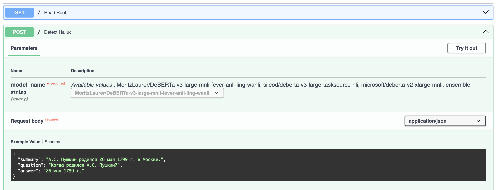

# Hallucination Detection Task

## Solution description

To solve the problem, models with transformer-based architecture pre-trained for the NLI task were selected. Next, each of them was additionally trained on the training set.

To evaluate on the test set, two approaches were used:

- a single fine-tuned transformer-based model from the list:
  1. `sileod/deberta-v3-large-tasksource-nli`
  2. `MoritzLaurer/DeBERTa-v3-large-mnli-fever-anli-ling-wanli`
  3. `microsoft/deberta-v2-xlarge-mnli`
- ensemble of the specified models with the `CatBoostClassifier` metamodel.

Model/ensemble selection is done in the `make_prediction.py` file.

Below are the Accuracy scores on the training set using cross-validation and the results on the test set. The scores for the training set are calculated in the files `models_evaluate.ipynb` and `ensemble_train.ipynb`.

|                 | sileod | MoritzLaurer | microsoft | Ensemble  |
| --------------- | ------ | ------------ | --------- | --------- |
| Accuracy, train | 0.951  | 0.935        | 0.930     | 0.944     |
| Accuracy, test  | 0.924  | 0.933        | 0.924     | 0.933     |

## Fine-tuning description

For each of the three above models, the fine-tuning process was the same:

- the model was fine-tuned 10 times, splitting the training set using the Stacking method:
  - the sample is divided into 10 folds with stratification;
  - each fine-tuning process begins from the same (pre-trained) state of the model;
  - for each fine-tuning process, its own fold is taken: 90% of the set is used for training, and the remaining 10% is used for validation and as data for subsequent training of the ensemble metamodel.
- the model was additionally trained one more time (final) on the entire training set.

The repository contains a file for fine-tuning and a file with hyperparameters (see "Repository structure").

[HF Hub with fine-tuned models](https://huggingface.co/ivankud)

[wandb graphics](https://wandb.ai/ivankud/X5-HACK)

## Backend description

To start the backend you need:

- in the `Dockerfile` file, uncomment the lines for loading all (three) models

```Dockerfile
RUN huggingface-cli download ivankud/DeBERTa-v3-large-mnli-fever-anli-ling-wanli
RUN huggingface-cli download ivankud/deberta-v3-large-tasksource-nli
RUN huggingface-cli download ivankud/deberta-v2-xlarge-mnli
```

- in the `Dockerfile` file uncomment the last line

```Dockerfile
CMD ["uvicorn", "backend:app", "--host", "127.0.0.1", "--port", "8000"]
```

- in the file `requirements.txt` uncomment the dependency block for the backend

```raw
fastapi==0.111.0
pydantic==2.7.1
uvicorn==0.29.0
```

- and execute commands to build the image and start the container

```bash
docker build -t halluc_detector .
docker run -it -p 8000:8000 halluc_detector
```

The backend will be available locally on port 8000 via the link [http://127.0.0.1:8000/docs](http://127.0.0.1:8000/docs)



## Repository structure

```raw
.
├── data                        # dataset
├── info
│   └── training_params.md      # fine-tuning hyperparameters
├── metamodel
│   ├── train-data              # metamodel training data
│   └── metamodel.cbm           # metamodel
├── notebooks
│   ├── eda.ipynb               # visualization of input data
│   └── ensemble_train.ipynb    # ensemble metamodel training
│   └── models_evaluate.ipynb   # evaluation of fine-tuned models
├── Dockerfile
├── requirements.txt
├── train.sh                    # starts fine-tuning
├── backend.py                  # backend on fastapi
├── collect_predictions.py      # aggregation of ensemble model predictions
├── ensemble_predict.py         # ensemble metamodel prediction
├── make_prediction.py          # starts prediction with model/ensemble selection
├── model_predict.py            # model prediction
├── model_train.py              # fine-tuning
├── utils.py
└── README.md
```
